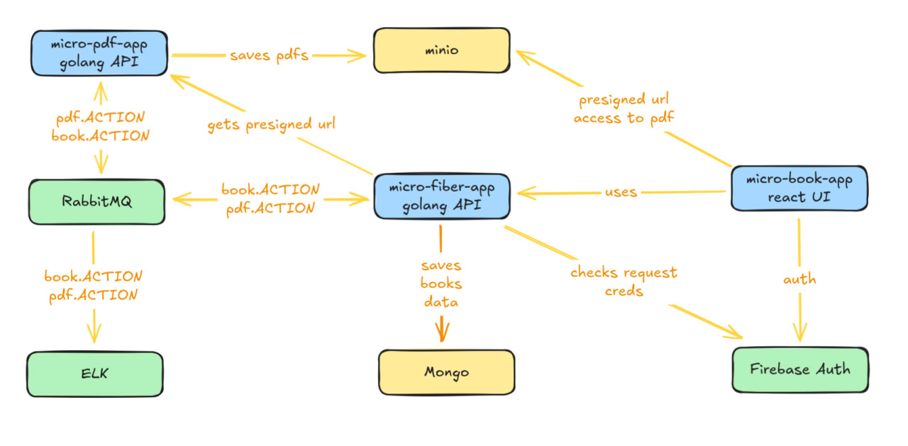
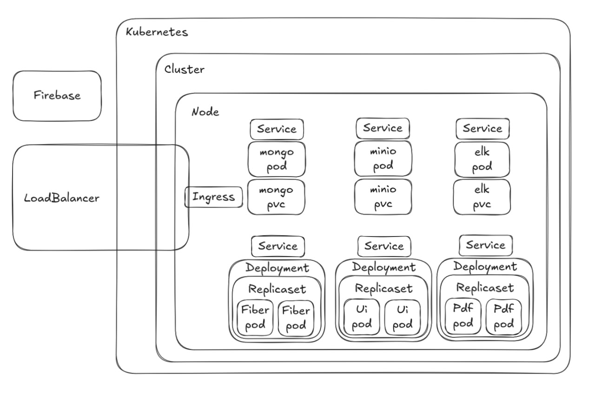

# ⚙️ micro-fiber-pet (Golang API)

🎥 **YouTube Guide:** [Watch the full setup here](https://youtu.be/2i8Fdb395yo)

---

## 🧠 Overview
**micro-fiber-pet** is a Golang backend service built with the **Fiber framework**.  
It manages pet (book-style) data, handles authentication, and coordinates event-driven communication between microservices.

This service interacts with:
- **MongoDB** for data persistence  
- **RabbitMQ** for asynchronous messaging  
- **Firebase Auth** for user validation  

## ⚙️ Core Features
- 📚 CRUD operations for pets (or book-style data)
- 🔐 Validates requests using **Firebase Auth**
- 📨 Publishes and consumes `book.ACTION` and `pdf.ACTION` events from **RabbitMQ**
- 💾 Saves structured data in **MongoDB**
- 🔗 Requests presigned URLs for PDF access from **micro-pdf-pet**

## 🧱 Architecture
- Stateless design — runs as **two pods** in Kubernetes  
- Uses a **single MongoDB** database shared across replicas  
- Listens to **RabbitMQ** for background task coordination  

## 🚀 Local Development
```bash
go mod tidy
go run main.go
```

## Global Schema



## Kubernetes Schema


📘 **micro-ui-pet** [github.com/lukashonok/micro-ui-pet](https://github.com/lukashonok/micro-ui-pet)
⚙️ **micro-fiber-pet** [github.com/lukashonok/micro-fiber-pet](https://github.com/lukashonok/micro-fiber-pet)
⚙️ **micro-pdf-pet** [github.com/lukashonok/micro-pdf-pet](https://github.com/lukashonok/micro-pdf-pet)
⚙️ **Shared Configs:** [github.com/lukashonok/micro-other-services-pet](https://github.com/lukashonok/micro-other-services-pet)